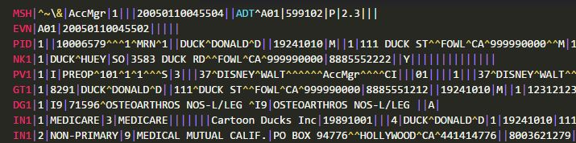
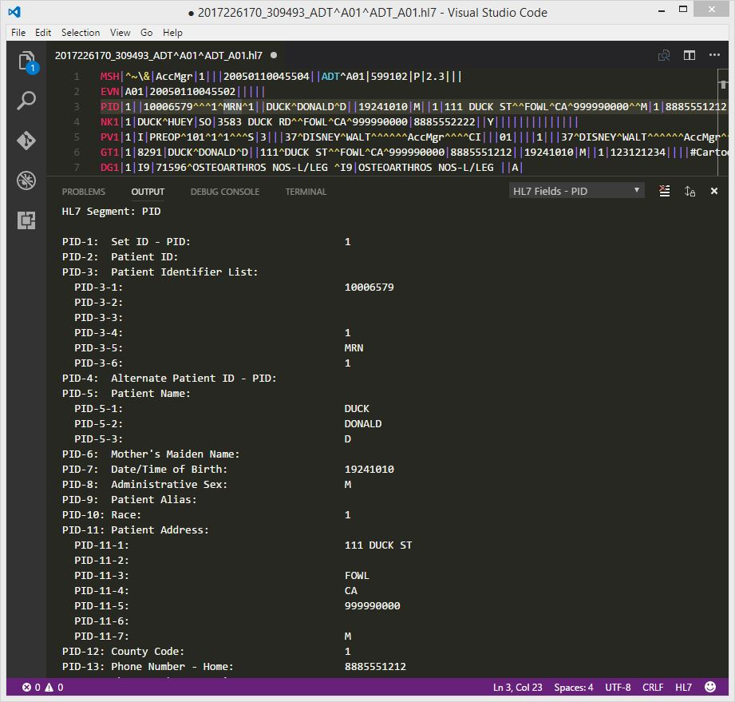
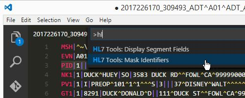
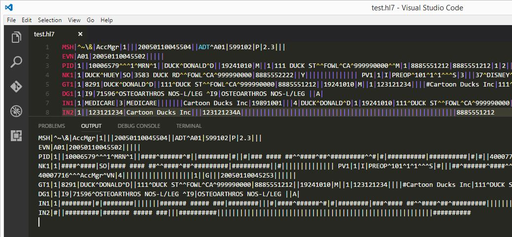

# hl7tools for Visual Studio Code README
This is a Visual Studio Code extension for working with HL7 v2.7 files. It provides basic syntax highlighting, and functions to:
* mask identifiers in the message.
* display fields from a segment in a list.

## Features
### Syntax highlighting
* Segment, field, component, subcomponent and repeat separators are highlighted. 

> Note: The default dark and light themes don't highlight the field separators, I've found the Monkai theme works best.

### Display segment fields
This function lists all fields from the currently selected segment in a list in the output window. Field components are indented. Any repeating field values are included.
* Select the segment in the message using the cursor.
* Press F1 --> HL7 Tools: Display Segment.
* The selected segment's fields will be displayed in the output window. Repeating fields will be included. 

### Mask patient identifiers
* Press F1 --> HL7 Tools: Mask Identifiers.

* Common patient and next of kin identifiers will be masked with a '#' character. The masked message will be displayed in the output window, the original message will not be changed.

> Note: The first identifier in the Patient Identifier List (PID-3) will remain, all additional identifiers in this list will be masked. It is assumed this ID isn't a named identifier and is still useful if messages need to be exchanged to troubleshoot issues. The aim is to mask common user identifiable fields such as name, address, etc. The full list of fields masked are:
>* PID-3 (all repeats except for the first), PID-4 to PID-17, PID-19 to PID-23, PID-26 to PID-28
>* NK1-2, NK1-4 to NK1-7, NK1-10 to NK1-16, NK1-19, NK1-20, NK1-25 to NK1-33, NK1-35, NK1-37, NK1-38
>* All IN1 fields after IN1-2
>* All IN2 fields

## Installation
### Visual Studio Code 
Press `F1` and enter the `ext install hl7tools` command.

### Manual Installation
Clone the [GitHub repository](https://github.com/RobHolme/vscode-hl7tools) under your local extensions folder:
* Windows: `%USERPROFILE%\.vscode\extensions`
* Mac / Linux: `$HOME/.vscode/extensions`

## Issues / Feature requests
You can submit your issues and feature requests on the GitHub [issues page](https://github.com/RobHolme/vscode-hl7tools/issues).

## Release Notes

### 1.0.0
Initial release.

## Credits
* The HL7 syntax highlighting was sourced from https://github.com/craighurley/sublime-hl7-syntax
* The Display Segment Fields function was based on a function from https://github.com/pagebrooks/vscode-hl7 
* the HL7 segment descriptions (segment.js) was extracted from http://github.com/fernandojsg/hl7-dictionary. To reduce disk footprint only the segment definitions were used, not the complete HL7 dictionary.

