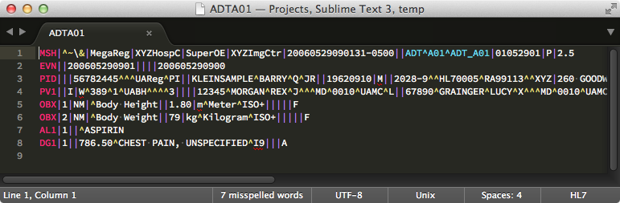

sublime-hl7-syntax
==================

Sublime Text syntax highlighting for HL7 content.

# Installation

## Manual

Sublime Text 2:

    git clone https://github.com/craighurley/sublime-hl7-syntax.git \
    ~/Library/Application\ Support/Sublime\ Text\ 2/Packages/sublime-hl7-syntax

Sublime Text 3:

    git clone https://github.com/craighurley/sublime-hl7-syntax.git \
    ~/Library/Application\ Support/Sublime\ Text\ 3/Packages/sublime-hl7-syntax

## Package Control

First, install the Package Control plugin, instructions here: http://wbond.net/sublime_packages/package_control.

Once you install Package Control, restart Sublime Text and bring up the Command Palette (<kbd>command+shift+p</kbd> on OS X, <kbd>super+shift+p</kbd> on Linux/Windows).

Select "Package Control: Install Package", wait while Package Control fetches the latest package list, then select "HL7" when the list appears.

# Usage

File types ending in `.edi` or `.hl7` should automatically have syntax highlighting applied, if not use the following commands to set syntax to HL7:
- Linux: <kbd>super+shift+p</kbd>, then type <kbd>ss hl7</kbd>
- Windows: <kbd>super+shift+p</kbd>, then type <kbd>ss hl7</kbd>
- OS X: <kbd>command+shift+p</kbd>, then type <kbd>ss hl7</kbd>

# Info

- http://www.sublimetext.com
- http://www.hl7.org
